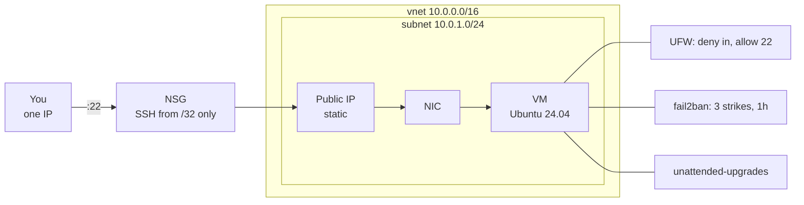

# Terraform-hardened-vm

This is a hardened Ubuntu box on Azure that starts up from nothing with one `apply`. Network, firewall, and host config all live in code.



Two firewalls, two layers. The NSG stops traffic at the Azure edge while UFW stops it on the host.

| | |
|---|---|
| Region | Canada Central |
| Size | `Standard_B2ts_v2` |
| Image | Ubuntu 24.04 LTS |
| SSH | key only, single source CIDR |
| Cost when destroyed | $0 |

## How to Run

```bash
az login
cp terraform.tfvars.example terraform.tfvars   # put your IP in it
terraform init
terraform plan
terraform apply
```

It takes a few minutes to be come live then use `terraform destroy` to make it go away once you're done.


You can check your IP with the following:
```bash
curl -s ifconfig.me    # this, with /32, is what goes in tfvars
```

## Design Decisions and Lessons Learnt

**SSH open to exactly one address.** Not `0.0.0.0/0`. The NSG rule takes a `/32`, so the port does not exist for anyone else. Cost of this: a changing IP locks me out. Fix is editing one line and running `apply`.

**`allowed_ssh_cidr` has no default.** Terraform refuses to run without a value. Research says opening SSH broadly should take a deliberate act not do it by default.

**cloud-init, not a `remote-exec` provisioner.** Provisioners need SSH working before the machine is hardened. cloud-init runs before first login, and the YAML doubles as documentation of what the host is.

**Static public IP.** Dynamic addresses get reassigned on deallocation, which would silently break the NSG rule and my SSH config on every rebuild.

**NSG on the NIC, not the subnet.** There's only one machine here, so the rules sit where the machine is. A subnet-level NSG makes more sense once several boxes share the same rules.

## Quota Issue

The first three `apply` runs failed. This happened because my Azure account didnt have an quota requested:

```
SkuNotAvailable: Standard_B1s is currently not available in location 'CanadaCentral'
OperationNotAllowed: exceeding approved standardBsv5Family Cores quota.
  Current Limit: 0
```

A fresh subscription has **zero** approved cores for most VM families. It's there but you have to request it a couple first.

```bash
# what is actually offered here
az vm list-skus --location canadacentral --size Standard_B2 --all -o table

# what I have quota for
az vm list-usage --location canadacentral -o table
```

Fix is Portal → Quotas → Compute → request an increase. It is was approved in a few minutes. I asked for BsV2.

## Verify

| Check | Command | |
|---|---|---|
| Non-root sudo user | `whoami && sudo -l` | ✅ |
| Password auth off | `sudo sshd -T \| grep -i passwordauth` | ✅ |
| Root login | `sudo sshd -T \| grep -i permitrootlogin` | ✅ |
| Firewall | `sudo ufw status verbose` | ✅ |
| fail2ban jail | `sudo fail2ban-client status sshd` | ✅ |
| Auto updates | `systemctl status unattended-upgrades` | ✅ |
| Timezone | `timedatectl` | ✅ |

`sshd -T` rather than grepping `sshd_config`. It shows the effective running config including `sshd_config.d/`, which is where Azure writes the password setting.

`auth.log` on this box is nearly empty. Not because fail2ban is working hard, but because the NSG means the scan traffic never arrives. The outer layer is doing most of the work; fail2ban is there for the day the outer layer is wrong.

## Test

```bash
terraform destroy
az group show --name rg-hardened-vm    # should not be found
terraform apply
```

New IP, same box, same results. Every setting came from the config, not from me logging in and fixing things.

## Files

```
main.tf                    resource group, network, NSG, NIC, VM
variables.tf               inputs, with allowed_ssh_cidr deliberately unset
outputs.tf                 public IP and a ready-made ssh command
cloud-init.yaml            packages, firewall, fail2ban, timezone
terraform.tfvars.example   copy to terraform.tfvars, add your IP
```

State is local and gitignored, along with `*.tfvars`. `.terraform.lock.hcl` is committed so provider versions are pinned.

## Stack

**Provisioning**
- Terraform (azurerm 4.x)

**Platform**
- Azure
- Ubuntu 24.04 LTS

**Host config**
- cloud-init
- UFW
- fail2ban
- unattended-upgrades
